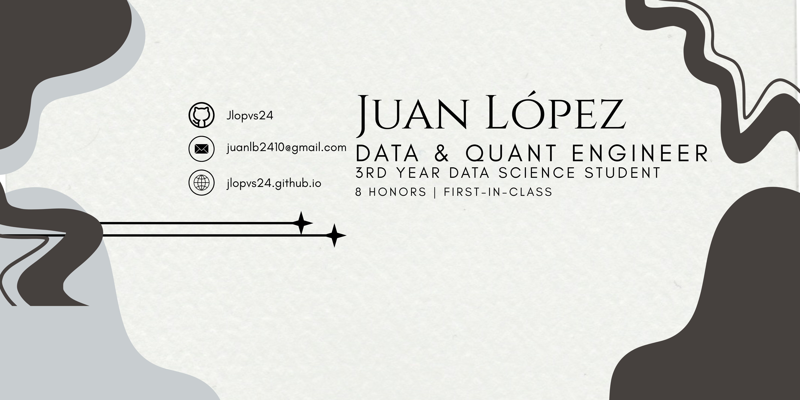

  

# Hello! 👋 I'm Juan López

### Data Science & Quantitative Systems | Academic Excellence Award

I am a third-year Data Science student at the **Universitat Politècnica de València (UPV)** with a strong mathematical background, focusing on **Data Engineering, Machine Learning Systems, and Quantitative Finance**. 

- 🏆 **Academic Excellence:** Ranked **1st out of 100+ students** in cohort (9.1 GPA) with 8 Honors (*Matrículas de Honor*) in Linear Algebra, Calculus, Data Structures...
- 🚀 **Leadership:** Serving as **Data Engineer & Project Manager** at [Sigma Data Club](https://www.linkedin.com/company/sigma-data-club-upv), designing PostgreSQL data pipelines and managing institutional data projects.
- 🌍 **International Training:** Took part in the **Beihang International Summer School** in Beijing (Embodied AI & Intelligent Systems).

---

### 💻 Skills & Technologies

* **Languages & Core:** Python, SQL, R
* **Data Engineering & Systems:** PostgreSQL, Docker, Docker Compose, ETL Pipelines, WebSockets, REST APIs, Git & GitHub
* **Data Science & ML:** Machine Learning (XGBoost, Scikit-learn), Time-Series Analysis, NLP, Vector DBs & LLMs

  <!-- Languages & Runtimes -->
  
  
  
  

  <!-- Data Science, ML & Frameworks -->
  
  
  
  
  

  <!-- Databases & Storage -->
  
  
  
  
  

  <!-- Tools & Environment -->
  
  
  

---

### 📫 Let's Connect!

  
  
  

